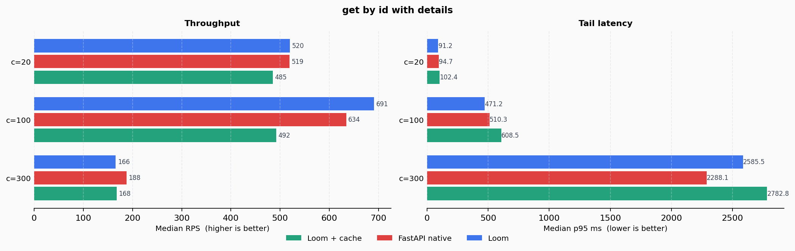
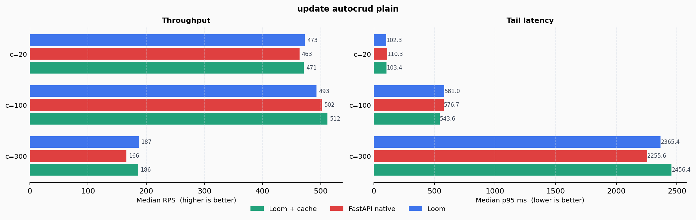

# dummy-loom


A realistic sandbox for validating [loom-py](https://github.com/the-reacher-data/loom-py) against a production-grade store API — with full benchmark tracking and fair comparison against a hand-written FastAPI equivalent.

---

## What is this?

`dummy-loom` is the proving ground for Loom framework ideas before they are promoted to the main library.
It hosts a realistic multi-entity store domain and a dedicated benchmark suite.

The benchmark answers one question:

> **How close to native FastAPI performance does Loom get, and what does the developer pay for the structure Loom provides?**

---

## The Example App

The store domain has five entities with realistic relations:

```
User ──< Address
User ──< Order ──< OrderItem >── Product
```

Each entity lives in its own module under `src/app/`:

```
src/app/
  user/           model · use_cases · interface
  address/        model · use_cases · interface
  product/        model · use_cases · interface · jobs · callbacks
  order/          model · use_cases · interface
  order_item/     model · use_cases · interface
  manifest.py     discovery registration
  main.py         ASGI entrypoint
  worker_main.py  Celery worker entrypoint
```

### Models

Models are `msgspec.Struct` subclasses compiled to SQLAlchemy at startup. `TimestampedModel` adds `created_at` / `updated_at`; plain `BaseModel` skips them.

```python
from loom.core.model import ColumnField, OnDelete, TimestampedModel, BaseModel

class User(TimestampedModel):
    __tablename__ = "users"
    id: int = ColumnField(primary_key=True, autoincrement=True)
    full_name: str = ColumnField(length=120)
    email: str = ColumnField(length=255, unique=True, index=True)

class Address(BaseModel):
    __tablename__ = "addresses"
    id: int = ColumnField(primary_key=True, autoincrement=True)
    user_id: int = ColumnField(foreign_key="users.id", on_delete=OnDelete.CASCADE, index=True)
    label: str = ColumnField(length=80)
    street: str = ColumnField(length=255)
    city: str = ColumnField(length=120)
    country: str = ColumnField(length=120)
    zip_code: str = ColumnField(length=20)
```

### Use Cases

#### Validation with rules

Rules are declared at class level and run before `execute()`. They validate command fields and resolved injection params.

```python
from loom.core.command import Command
from loom.core.use_case import F, Exists, Input, Rule
from loom.core.use_case.use_case import UseCase

class CreateUser(Command, frozen=True):
    full_name: str
    email: str

def _name_must_not_be_blank(full_name: str) -> str | None:
    return None if full_name.strip() else "full_name must not be blank"

def _email_must_be_valid(email: str) -> str | None:
    return None if _EMAIL_RE.fullmatch(email) else "email must be valid"

CREATE_NAME_RULE = Rule.check(F(CreateUser).full_name, via=_name_must_not_be_blank)
CREATE_EMAIL_FORMAT_RULE = Rule.check(F(CreateUser).email, via=_email_must_be_valid)
CREATE_EMAIL_UNIQUE_RULE = Rule.forbid(
    lambda _, __, email_exists: email_exists,
    message="email already exists",
).from_params("email_exists")

class CreateUserUseCase(UseCase[User, User]):
    rules = [CREATE_NAME_RULE, CREATE_EMAIL_FORMAT_RULE, CREATE_EMAIL_UNIQUE_RULE]

    async def execute(
        self,
        cmd: CreateUser = Input(),
        email_exists: bool = Exists(User, from_command="email", against="email"),
    ) -> User:
        return await self.main_repo.create(cmd)
```

- `Input()` — binds the HTTP request body as a typed command
- `Exists(...)` — checks a DB condition; result available in rules and `execute()`
- `Rule.check(field, via=fn)` — calls `fn(value)`, fails if it returns an error string
- `Rule.forbid(fn, message)` — fails if `fn` returns truthy; receives `(cmd, fields, *params)`
- `.from_params(*names)` — forwards resolved injection values into the rule predicate

#### Partial updates with Patch

```python
from loom.core.command import Command, Patch
from loom.core.use_case import F, Rule

class UpdateUser(Command, frozen=True):
    full_name: Patch[str] = None
    email: Patch[str] = None

UPDATE_NAME_RULE = (
    Rule.check(F(UpdateUser).full_name, via=_name_must_not_be_blank)
    .when_present(F(UpdateUser).full_name)
)

class UpdateUserUseCase(UseCase[User, User | None]):
    rules = [UPDATE_NAME_RULE, UPDATE_EMAIL_FORMAT_RULE, UPDATE_EMAIL_UNIQUE_RULE]

    async def execute(
        self,
        user_id: int,
        cmd: UpdateUser = Input(),
        current_user: User = LoadById(User, by="user_id"),
        email_exists: bool = Exists(User, from_command="email", against="email"),
    ) -> User | None:
        return await self.main_repo.update(user_id, cmd)
```

`Patch[T]` fields default to `None` (not sent). `.when_present(field)` gates a rule so it only runs when the field is explicitly included in the request.

#### Cross-entity FK validation with OnMissing

```python
from loom.core.use_case import Exists, OnMissing

class CreateOrderUseCase(UseCase[Order, Order]):
    rules = [CREATE_STATUS_RULE]

    async def execute(
        self,
        cmd: CreateOrder = Input(),
        _user_exists: bool = Exists(
            User, from_command="user_id", against="id", on_missing=OnMissing.RAISE
        ),
        _address_exists: bool = Exists(
            Address, from_command="address_id", against="id", on_missing=OnMissing.RAISE
        ),
    ) -> Order:
        return await self.main_repo.create(cmd)
```

`OnMissing.RAISE` returns a structured 404 before `execute()` even runs — no `if` guard in the body.

#### Sub-resource scoping

Address routes live under `/users/{user_id}/addresses/...`. The use case filters by `user_id` directly via `QuerySpec`, scoping results to the parent:

```python
from loom.core.repository.abc.query import FilterGroup, FilterOp, FilterSpec, QuerySpec

class ListAddressesUseCase(UseCase[Address, PageResult[Address] | CursorResult[Address]]):
    async def execute(
        self,
        user_id: int,
        query: QuerySpec,
        profile: str = "default",
    ) -> PageResult[Address] | CursorResult[Address]:
        scoped_query = QuerySpec(
            filters=FilterGroup(
                filters=(FilterSpec(field="user_id", op=FilterOp.EQ, value=user_id),),
            ),
            sort=query.sort,
            pagination=query.pagination,
            limit=query.limit,
            page=query.page,
            cursor=query.cursor,
        )
        return await self.main_repo.list_with_query(scoped_query, profile=profile)
```

#### Custom query use case

`QuerySpec` builds typed queries without raw SQL. Filters, sort, and pagination are declared explicitly:

```python
from loom.core.repository.abc.query import (
    FilterGroup, FilterOp, FilterSpec, PageResult, PaginationMode, QuerySpec, SortSpec,
)

class ListLowStockProductsUseCase(UseCase[Product, PageResult[Product]]):
    async def execute(self, profile: str = "default") -> PageResult[Product]:
        query = QuerySpec(
            filters=FilterGroup(
                filters=(FilterSpec(field="stock", op=FilterOp.LTE, value=5),)
            ),
            sort=(
                SortSpec(field="stock", direction="ASC"),
                SortSpec(field="id", direction="ASC"),
            ),
            pagination=PaginationMode.OFFSET,
            limit=20,
            page=1,
        )
        result = await self.main_repo.list_with_query(query, profile=profile)
        if not isinstance(result, PageResult):
            raise RuntimeError("Expected offset pagination result")
        return result
```

---

### Background Jobs

Jobs run in a Celery worker. Each class declares a `__queue__`, an optional typed `Command` via `Input()`, and can auto-load entities with `LoadById` — the same injection system as use cases.

#### Job definition

```python
from loom.core.command import Command
from loom.core.job.job import Job
from loom.core.use_case import Input, LoadById

class SendRestockEmailJobCommand(Command, frozen=True):
    product_id: int
    recipient_email: str
    force_fail: bool = False

class SendRestockEmailJob(Job[bool]):
    """Simulate sending a restock notification email."""

    __queue__ = "notifications"

    async def execute(
        self,
        product_id: int,
        cmd: SendRestockEmailJobCommand = Input(),
        product: Product = LoadById(Product, by="product_id"),
    ) -> bool:
        if cmd.force_fail:
            raise RuntimeError("forced restock email failure")
        return product.stock == 0
```

- `__queue__` — Celery queue name for this job class
- `Input()` — deserializes the job payload into the typed command
- `LoadById(Model, by="param")` — loads the entity from the repo before `execute()` runs

#### Fire-and-forget dispatch

```python
from loom.core.job.service import JobService

class DispatchRestockEmailUseCase(UseCase[Product, DispatchRestockEmailResponse]):
    def __init__(self, job_service: JobService) -> None:
        self._jobs = job_service

    async def execute(
        self,
        product_id: str,
        cmd: DispatchRestockEmailCommand = Input(),
    ) -> DispatchRestockEmailResponse:
        handle = self._jobs.dispatch(
            SendRestockEmailJob,
            params={"product_id": int(product_id)},
            payload={
                "product_id": int(product_id),
                "recipient_email": cmd.recipient_email,
                "force_fail": cmd.force_fail,
            },
            on_success=RestockEmailSuccessCallback,
            on_failure=RestockEmailFailureCallback,
        )
        return DispatchRestockEmailResponse(job_id=handle.job_id, queue=handle.queue)
```

`dispatch()` returns a handle with `job_id` and `queue`. The job runs asynchronously in the Celery worker. `on_success` and `on_failure` are optional callback classes registered per dispatch.

#### Inline execution

`run()` executes the job logic in-process and returns its result. No Celery involved — useful when you need the result synchronously:

```python
class BuildProductSummaryUseCase(UseCase[Product, ProductSummaryResponse]):
    def __init__(self, job_service: JobService) -> None:
        self._jobs = job_service

    async def execute(self, product_id: str) -> ProductSummaryResponse:
        summary = await self._jobs.run(
            BuildProductSummaryJob,
            params={"product_id": int(product_id)},
        )
        return ProductSummaryResponse(product_id=int(product_id), summary=summary)
```

#### Batch dispatch with rule validation

```python
SYNC_PRODUCT_IDS_RULE = Rule.check(
    F(SyncProductsCommand).product_ids,
    via=lambda ids: None if ids else "product_ids must include at least one product",
)

class SyncProductsToErpUseCase(UseCase[Product, SyncProductsResponse]):
    rules = [SYNC_PRODUCT_IDS_RULE]

    def __init__(self, job_service: JobService) -> None:
        self._jobs = job_service

    async def execute(self, cmd: SyncProductsCommand = Input()) -> SyncProductsResponse:
        handles = [
            self._jobs.dispatch(
                SyncProductToErpJob,
                params={"product_id": pid},
                payload={"product_id": pid, "force_fail": pid in set(cmd.force_fail_ids)},
            )
            for pid in cmd.product_ids
        ]
        return SyncProductsResponse(
            dispatched=len(handles),
            job_ids=[h.job_id for h in handles],
        )
```

#### Use-case chain + job dispatch (workflow)

`ApplicationInvoker` lets a use case call another use case by type — no tight coupling:

```python
from loom.core.use_case.invoker import ApplicationInvoker

class RestockWorkflowUseCase(UseCase[Product, RestockWorkflowResponse]):
    def __init__(self, app: ApplicationInvoker, job_service: JobService) -> None:
        self._app = app
        self._jobs = job_service

    async def execute(
        self,
        product_id: str,
        cmd: DispatchRestockEmailCommand = Input(),
    ) -> RestockWorkflowResponse:
        # Step 1: invoke another use case by type
        summary_result = await self._app.invoke(
            BuildProductSummaryUseCase,
            params={"product_id": int(product_id)},
        )
        # Step 2: dispatch a job with callbacks
        handle = self._jobs.dispatch(
            SendRestockEmailJob,
            params={"product_id": int(product_id)},
            payload={
                "product_id": int(product_id),
                "recipient_email": cmd.recipient_email,
                "force_fail": cmd.force_fail,
            },
            on_success=RestockEmailSuccessCallback,
            on_failure=RestockEmailFailureCallback,
        )
        return RestockWorkflowResponse(
            summary=summary_result.summary,
            restock_job_id=handle.job_id,
            queue=handle.queue,
        )
```

---

### Callbacks

Callbacks fire after a job succeeds or fails in the Celery worker. They are instantiated via DI and can invoke use cases through `ApplicationInvoker`.

```python
from typing import Any
from loom.core.use_case.invoker import ApplicationInvoker

class RestockEmailSuccessCallback:
    """Tags the product category when the restock email was sent successfully."""

    def __init__(self, app: ApplicationInvoker) -> None:
        self._app = app

    async def on_success(self, job_id: str, result: Any, **context: Any) -> None:
        if not bool(result):
            return  # job returned False — email was skipped (stock > 0)
        await _apply_category_suffix(self._app, context=context, suffix="restock-notified")

    def on_failure(self, job_id: str, exc_type: str, exc_msg: str, **context: Any) -> None:
        pass  # noop

class RestockEmailFailureCallback:
    """Tags the product category when the restock email job fails."""

    def __init__(self, app: ApplicationInvoker) -> None:
        self._app = app

    def on_success(self, job_id: str, result: Any, **context: Any) -> None:
        pass  # noop

    async def on_failure(
        self, job_id: str, exc_type: str, exc_msg: str, **context: Any
    ) -> None:
        await _apply_category_suffix(self._app, context=context, suffix="restock-failed")
```

- `on_success` receives the job return value and the original `params` dict as `**context`
- `on_failure` receives `exc_type`, `exc_msg`, and `**context`
- Both methods are optional — implement only the ones you need
- Methods can be sync or async; the framework awaits if needed
- `ApplicationInvoker.entity(Model)` returns a scoped entity accessor (get / update / delete)

---

### REST Interfaces

`RestInterface` maps use cases to HTTP routes. Custom routes and auto-generated CRUD coexist in the same `routes` tuple:

```python
from loom.rest.autocrud import build_auto_routes
from loom.rest.model import PaginationMode, RestInterface, RestRoute

class ProductRestInterface(RestInterface[Product]):
    prefix = "/products"
    tags = ("Products",)
    pagination_mode = PaginationMode.CURSOR
    routes = (
        RestRoute(
            use_case=ListLowStockProductsUseCase,
            method="GET",
            path="/low-stock",
            summary="List low stock products",
        ),
        RestRoute(
            use_case=DispatchRestockEmailUseCase,
            method="POST",
            path="/{product_id}/jobs/restock-email",
            status_code=202,
            summary="Dispatch restock email job",
        ),
        RestRoute(
            use_case=RestockWorkflowUseCase,
            method="POST",
            path="/{product_id}/workflows/restock",
            status_code=202,
            summary="Run restock workflow",
        ),
        *build_auto_routes(Product, ()),  # GET /, GET /{id}, POST /, PATCH /{id}, DELETE /{id}
    )
```

- `build_auto_routes(Model, exclude_fields)` generates the five standard CRUD routes
- `status_code=202` marks the route as async — the handler returns immediately with a job handle
- Sub-resource routes follow the same pattern; `prefix` and `path` compose the full URL

---

### Discovery manifest

`manifest.py` registers all components explicitly. The YAML config points to this module; the framework wires DI, DB, routes, and the Celery worker from these lists:

```python
MODELS = [User, Address, Product, Order, OrderItem]

USE_CASES = [
    CreateUserUseCase, GetUserUseCase, ListUsersUseCase, UpdateUserUseCase, DeleteUserUseCase,
    # ... all use cases across all domains
    ListLowStockProductsUseCase, DispatchRestockEmailUseCase,
    BuildProductSummaryUseCase, RestockWorkflowUseCase, SyncProductsToErpUseCase,
]

JOBS = [SendRestockEmailJob, BuildProductSummaryJob, SyncProductToErpJob]

CALLBACKS = [RestockEmailSuccessCallback, RestockEmailFailureCallback]

INTERFACES = [
    UserRestInterface, AddressRestInterface, ProductRestInterface,
    OrderRestInterface, OrderItemRestInterface,
]
```

The API and worker read the same manifest. The API bootstrap compiles models, routes, and use cases; the worker bootstrap compiles jobs and the use cases required by callbacks.

---

## Benchmark

Loom matches or outperforms a hand-written FastAPI application at the concurrency levels typical of production REST APIs.

Five scenarios were benchmarked at c=20, c=100, and c=300. Three independent runs per pair, median RPS reported. Each target runs in an isolated Docker container with its own PostgreSQL instance and CPU pinning.

**loompy vs fastapi-native (gap, dev30 · 3-repeat median):**

| Scenario | c=20 | c=100 | c=300 |
|----------|------|-------|-------|
| `ping` (no DB) | ≈ tied | −5.1 % | **+16.5 %** |
| `get_by_id_with_details` | ≈ tied | **+8.9 %** | −11.7 % |
| `list_cursor_no_count` | −2.8 % | **+3.8 %** | −19.4 % |
| `list_offset_with_count` | ≈ tied | **+6.2 %** | −25.3 % |
| `update_autocrud_plain` | **+2.1 %** | ≈ tied | **+12.7 %** |

**Loom wins or ties on 4 of 5 scenarios at c=20 and c=100 (normal production load).**
At c=300 (DB pool saturation), outcomes depend on SQL count per request — not framework overhead.

#### get_by_id_with_details — Loom +8.9% at c=100



The compiled single-pass read path for the `with_details` profile (record + owner JOIN + notes batch) assembles the struct directly from the result set — no intermediate dicts, no Pydantic validators. At c=100 this produces an **+8.9 %** throughput advantage over the hand-written equivalent.

#### update_autocrud_plain — from −28% to +12.7%



From dev30 both targets use a single `UPDATE … RETURNING` round-trip. Earlier versions of Loom used a 3-step SELECT + setattr + flush, producing a −28 % gap at c=100. The optimisation recovered the entire deficit at **zero developer-facing API cost**. At c=300 Loom delivers **+12.7 %** more throughput.

Full methodology, raw data for all three targets, per-scenario analysis, and cache breakdown:
→ [benchmarks/docs/results.md](benchmarks/docs/results.md)

---

## Run it yourself

### Benchmark

```
make benchmark-isolated-up    # start 3 isolated Postgres + 3 app containers
make benchmark-isolated       # run benchmark_external.py
uv run --no-project --with matplotlib python benchmarks/scripts/plot_benchmark_results.py
make benchmark-isolated-down  # tear down
```

### Environment

| Variable | Default | Description |
|----------|---------|-------------|
| `BENCH_REPEATS` | `3` | Measurement repeats per scenario |
| `BENCH_WARMUP` | `200` | Warmup requests per scenario/concurrency |
| `BENCH_CONCURRENCIES` | `20,100,300` | Concurrency levels |
| `BENCH_SEED_RECORDS` | `1200` | Records in dataset |
| `BENCH_SCENARIOS` | all | Comma-separated scenario filter |

Raw JSON results land in `benchmarks/raw/`. Charts and report in `docs/`.

---

## Local app setup

```bash
make install
make migrate
make run
```

Docker (postgres + redis + celery + monitor):

```bash
make up
make logs
```

Quality:

```bash
make test
make coverage
make check
```

Services after `make up`:

| Service | Port | Description |
|---------|------|-------------|
| `api` | 8000 | FastAPI application (Swagger at `/docs`) |
| `worker` | — | Celery worker (queues: notifications, analytics, erp) |
| `monitor` | 5555 | Plywatch monitor dashboard (`http://localhost:5555`) |
| `postgres` | 5432 | PostgreSQL 16 |
| `redis` | 6379 | Broker and result backend |

---

## Loom References

- [Framework repository](https://github.com/the-reacher-data/loom-py)
- [Published documentation](https://loom-py.readthedocs.io/en/latest/)
- [Documentation source](https://github.com/the-reacher-data/loom-py/tree/main/specs)
- [Plywatch monitor documentation](https://the-reacher-data.github.io/plywatch/)
