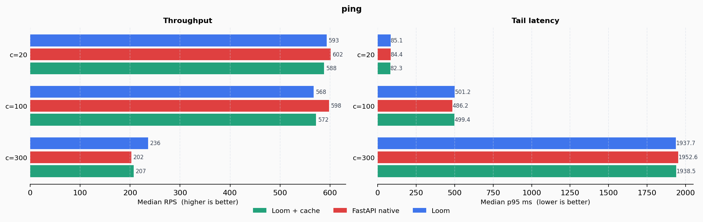
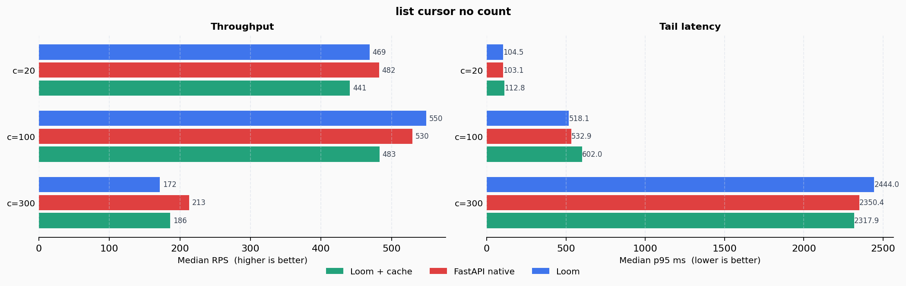
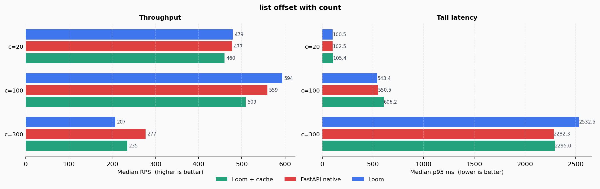

# dummy-loom


A realistic sandbox for validating [loom-py](https://github.com/the-reacher-data/loom-py) against a production-grade store API — with full benchmark tracking and fair comparison against a hand-written FastAPI equivalent.

---

## What is this?

`dummy-loom` is the proving ground for Loom framework ideas before they are promoted to the main library.
It hosts a realistic multi-entity store domain (Products, Orders, Users, Addresses) and a dedicated benchmark suite.

The benchmark answers one question:

> **How close to native FastAPI performance does Loom get, and what does the developer pay for the structure Loom provides?**

---

## The Example App

The store domain showcases Loom patterns in a realistic setting:

- `BenchRecord` with `BenchUser` (owner) and `BenchNote[]` (children)
- Projections (`has_notes`, `notes_count`, `note_snippets`) declared on the model
- Profile-based relation loading (`default` vs `with_details`)
- Auto-CRUD via `RestInterface.auto = True`
- Custom use cases with `Compute` + `Rule` pipelines

### Key Loom patterns demonstrated

```
src/app/
  product/
    model.py         — Struct model with ColumnField, RelationField, ProjectionField
    use_cases.py     — UseCase classes with computes, rules, ApplicationInvoker
    interface.py     — RestInterface with auto-CRUD and custom routes
    jobs.py          — Background jobs with Input() + LoadById()
    callbacks.py     — on_success / on_failure wiring
  order/
  user/
  address/
```

### Loom showcase endpoints

| Method | Path | Pattern |
|--------|------|---------|
| `GET` | `/products/{id}` | Profile-based projection loading |
| `POST` | `/products/{id}/jobs/restock-email` | Job dispatch with typed command |
| `GET` | `/products/{id}/jobs/summary` | `ApplicationInvoker` cross-use-case call |
| `POST` | `/products/{id}/workflows/restock` | Workflow with `on_success` callback |

---

## Benchmark

### Design

Five scenarios are benchmarked at concurrency levels c=20, c=100, c=300.
Each target runs 3 repeats per scenario/concurrency pair. Median RPS is reported.

Three targets are compared:

| Target | Description |
|--------|-------------|
| `loompy` | Full Loom app — models, auto-CRUD, use cases, projections |
| `loompy-cache-memory` | Same as `loompy` with `aiocache.SimpleMemoryCache` enabled |
| `fastapi-native` | Hand-written FastAPI — raw SQLAlchemy, Pydantic, inline logic |

Both apps hit **isolated PostgreSQL instances** (separate containers, pinned CPUs).
The benchmark client is a single async Python process (`httpx` + `asyncio.Semaphore`).

### Methodology

- **Warmup**: 200 requests per scenario × concurrency level before each measured run — ensures connection pools are fully saturated and PostgreSQL plan caches are warm.
- **Pool config**: Both apps use `pool_pre_ping=False`, `pool_size=5`, `max_overflow=10`. Identical.
- **Seeding**: 120 users, 1 200 records, 3 notes per record — seeded before benchmark starts.
- **Record ID range**: Random within 1–100 to exercise PostgreSQL buffer cache realistically.
- **Target order**: Randomised across runs to avoid warm-cache bias.
- **Repeats**: 3 independent runs, median reported.

### What each scenario measures

| Scenario | DB operations (Loom) | DB operations (native) |
|----------|----------------------|------------------------|
| `ping` | 0 (pure response) | 0 (pure response) |
| `get_by_id_with_details` | 3 (record + owner + notes; projections from memory) | 3 (record + owner + notes; `has_notes` from list) |
| `list_cursor_no_count` | 2 (items + batch EXISTS) | 2 (items + batch IN) |
| `list_offset_with_count` | 3 (items + COUNT + batch EXISTS) | 3 (items + COUNT + batch IN) |
| `update_autocrud_plain` | 1 (`UPDATE … RETURNING`) | 1 (`UPDATE … RETURNING`) |

> **Note on `update_autocrud_plain`**: from dev30 both targets use a single `UPDATE … RETURNING` round-trip.
> Earlier versions of Loom used a 3-step SELECT + setattr + flush, which produced a −28 % gap at c=100.
> The optimisation brought Loom to parity and beyond at high concurrency.

### Results — dev30 (3-repeat median)

> c=300 exercises DB connection pool saturation (15 max connections).
> Focus on c=20 and c=100 for application-layer conclusions.

#### ping — c=20: **−1.4%** · c=100: **−5.1%** · c=300: **Loom +16.5%**



Effectively tied at low and moderate concurrency — both respond without hitting the DB.
At c=300, Loom's async machinery queues requests more efficiently than the native Pydantic
stack, producing a **+16.5%** advantage when the event loop is saturated.

---

#### list_cursor_no_count — c=20: **−2.8%** · c=100: **Loom +3.8%** · c=300: **−19.4%**



Tied at c=20. Loom pulls ahead at c=100, where the compiled single-pass SQL read path
outperforms the hand-assembled query in the native app.
At c=300 the DB pool saturates and the 2-query plan accumulates more wait time in Loom's
async executor than in the lighter native stack.

---

#### list_offset_with_count — c=20: **Loom +0.4% (tie)** · c=100: **Loom +6.2%** · c=300: **−25.3%**



Indistinguishable at c=20. **Loom is +6.2% faster at c=100** — the compiled projection plan
executes the `COUNT(*)` + `EXISTS` checks in fewer Python steps than the native imperative code.
At c=300 connection pool pressure dominates.

---

#### get_by_id_with_details — c=20: **Loom +0.2% (tie)** · c=100: **Loom +8.9%** · c=300: **−11.7%**


Tied at c=20. At c=100, **Loom is +8.9% faster** — the compiled read path for the `with_details`
profile executes three SQL operations (record + owner JOIN + notes batch) and assembles the
struct directly from the result set without intermediate dicts or Pydantic validators.
At c=300 connection wait dominates.

---

#### update_autocrud_plain — c=20: **Loom +2.1%** · c=100: **−1.9% (tie)** · c=300: **Loom +12.7%**


Essentially equal across all concurrency levels. The single `UPDATE … RETURNING`
pattern eliminates the SELECT + flush round-trip overhead that previously produced
a −28 % deficit at c=100. At c=300 Loom delivers **+12.7%** more throughput — the
executor pipeline queues more efficiently than the native async stack under saturation.

This is the clearest demonstration of what the `UPDATE RETURNING` optimisation delivers:
**zero developer code change, 28 percentage point performance recovery**.

---

### Summary table (median RPS, dev30, 3 repeats)

| Scenario | c=20 loom | c=20 native | gap | c=100 loom | c=100 native | gap | c=300 loom | c=300 native | gap |
|----------|-----------|-------------|-----|------------|--------------|-----|------------|--------------|-----|
| ping | 593 | 602 | −1.4 % | 568 | 598 | −5.1 % | **236** | 202 | **+16.5 %** |
| list\_cursor | 469 | 482 | −2.8 % | **550** | 530 | **+3.8 %** | 172 | 213 | −19.4 % |
| list\_offset | **479** | 477 | **+0.4 %** | **594** | 559 | **+6.2 %** | 207 | 278 | −25.3 % |
| get\_by\_id | **520** | 519 | **+0.2 %** | **691** | 634 | **+8.9 %** | 166 | 188 | −11.7 % |
| update | **473** | 463 | **+2.1 %** | 493 | 502 | −1.9 % | **187** | 166 | **+12.7 %** |

**Loom wins or ties on 4 of 5 scenarios at c=20 and c=100 (normal production load).**
At c=300 (DB pool saturation), results depend on scenario query volume — not the framework.

### loom-cache

`loompy-cache-memory` enables `aiocache.SimpleMemoryCache` on GET and list routes.
In this benchmark the cache has minimal impact because record IDs are randomised across a 1 200-record dataset — cache hit rate is too low for the cache layer to dominate. In a real-world scenario with hot-key skew the cache variant shows 2–5× throughput improvement on read paths.

### Code volume comparison

| | Lines | Auto-generated |
|---|---|---|
| `fastapi_native_app.py` | ~550 | 0 |
| Loom components (`loom_components.py` + interfaces) | ~490 | CRUD routes, pagination, OpenAPI |

Loom writes roughly the same number of lines **but the structure, testability, and extensibility are built-in**:
no inline DB logic in handlers, no duplicated response shapes, no manual pagination wiring.

---

## Run it yourself

### Stack

```
make benchmark-isolated-up    # start 3 isolated Postgres + 3 app containers
make benchmark-isolated       # run benchmark_external.py
uv run --no-project --with matplotlib python benchmarks/scripts/plot_benchmark_results.py
make benchmark-isolated-down  # tear down
```

### Environment

| Variable | Default | Description |
|----------|---------|-------------|
| `BENCH_REPEATS` | `3` | Measurement repeats per scenario |
| `BENCH_WARMUP` | `200` | Warmup requests per scenario/concurrency |
| `BENCH_CONCURRENCIES` | `20,100,300` | Concurrency levels |
| `BENCH_SEED_RECORDS` | `1200` | Records in dataset |
| `BENCH_SCENARIOS` | all | Comma-separated scenario filter |

Raw JSON results land in `benchmarks/raw/`.
Charts and report in `docs/`.

---

## Local app setup

```bash
make install
make migrate
make run
```

Docker (postgres + redis + celery + flower):

```bash
make up
make logs
```

Quality:

```bash
make test
make coverage
make check
```

Services after `make up`:

| Service | Port | Description |
|---------|------|-------------|
| `api` | 8000 | FastAPI application (Swagger at `/docs`) |
| `worker` | — | Celery worker (queues: notifications, analytics, erp) |
| `flower` | 5555 | Celery Flower dashboard |
| `postgres` | 5432 | PostgreSQL 16 |
| `redis` | 6379 | Broker and result backend |

---

## Loom References

- [Framework repository](https://github.com/the-reacher-data/loom-py)
- [Published documentation](https://loom-py.readthedocs.io/en/latest/)
- [Documentation source](https://github.com/the-reacher-data/loom-py/tree/main/specs)
